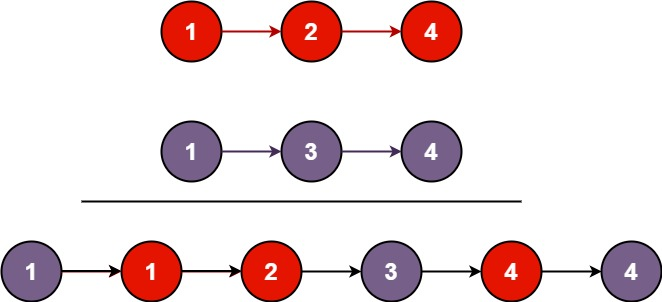

```swift
You are given the heads of two sorted linked lists list1 and list2.

Merge the two lists into one sorted list. The list should be made by splicing together the nodes of the first two lists.

Return the head of the merged linked list.
```
 

**Example 1:**



```swift
Input: list1 = [1,2,4], list2 = [1,3,4]
Output: [1,1,2,3,4,4]
```

**Example 2:**
```swift
Input: list1 = [], list2 = []
Output: []
```
**Example 3:**
```swift
Input: list1 = [], list2 = [0]
Output: [0]
 ```

**Constraints:**
```swift
The number of nodes in both lists is in the range [0, 50].
-100 <= Node.val <= 100
Both list1 and list2 are sorted in non-decreasing order.
```
**Solution**

```swift
/**
 * Definition for singly-linked list.
 * public class ListNode {
 *     public var val: Int
 *     public var next: ListNode?
 *     public init() { self.val = 0; self.next = nil; }
 *     public init(_ val: Int) { self.val = val; self.next = nil; }
 *     public init(_ val: Int, _ next: ListNode?) { self.val = val; self.next = next; }
 * }
 */
class Solution {
    func mergeTwoLists(_ list1: ListNode?, _ list2: ListNode?) -> ListNode? {
        //
        var l1 = list1
        var l2 = list2
        var dummy = ListNode(0)
        var currentNode = dummy
        //
        while(l1 != nil && l2 != nil) {
            if l1!.val < l2!.val {
                currentNode.next = l1
                l1 = l1!.next
            } else {
                currentNode.next = l2
                l2 = l2!.next
            }
            currentNode = currentNode.next!
        }
        //
        currentNode.next = l1 ?? l2
        //
        return dummy.next
    }
}
```
