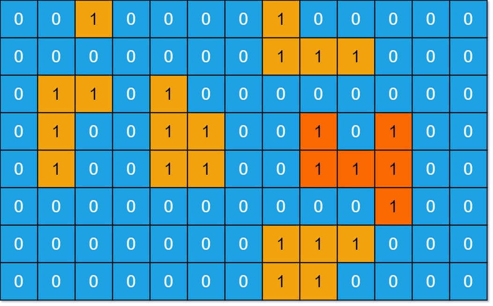

```swift
You are given an m x n binary matrix grid. An island is a group of 1's (representing land) connected 4-directionally (horizontal or vertical.) You may assume all four edges of the grid are surrounded by water.

The area of an island is the number of cells with a value 1 in the island.

Return the maximum area of an island in grid. If there is no island, return 0.
```
 https://leetcode.com/problems/max-area-of-island/description/

**Example 1:**


```swift
Input: grid = [[0,0,1,0,0,0,0,1,0,0,0,0,0],[0,0,0,0,0,0,0,1,1,1,0,0,0],[0,1,1,0,1,0,0,0,0,0,0,0,0],[0,1,0,0,1,1,0,0,1,0,1,0,0],[0,1,0,0,1,1,0,0,1,1,1,0,0],
[0,0,0,0,0,0,0,0,0,0,1,0,0],[0,0,0,0,0,0,0,1,1,1,0,0,0],[0,0,0,0,0,0,0,1,1,0,0,0,0]]
Output: 6
Explanation: The answer is not 11, because the island must be connected 4-directionally.
```

**Example 2:**

```swift
Input: grid = [[0,0,0,0,0,0,0,0]]
Output: 0
```

**Constraints:**
```swift
m == grid.length
n == grid[i].length
1 <= m, n <= 50
grid[i][j] is either 0 or 1.
```
**Solution**

```swift
class Solution {
    func maxAreaOfIsland(_ grid: [[Int]]) -> Int {
        //
        var grid = grid
        var rowCount: Int = grid.count
        var colCount = grid[0].count
        var maxArea: Int = 0

        //
        func dfs(_ r: Int, _ c: Int) -> Int {
            if r < 0 || c < 0 || r >= rowCount || c >= colCount || grid[r][c] == 0 {
                return 0
            }
            grid[r][c] = 0

            return (1 + (dfs(r + 1, c) + dfs(r - 1, c) + dfs(r, c + 1) + dfs(r, c - 1)))
        }

        for i in 0..<rowCount {
            for j in 0..<colCount {
                if grid[i][j] == 1 {
                    maxArea = max(dfs(i, j), maxArea)
                }
            }
        }
        //
        return maxArea
    }
}
```


```swift
Time Complexity: O(m * n) → each cell visited once
Space Complexity: O(m * n) (worst-case recursion stack)
```
