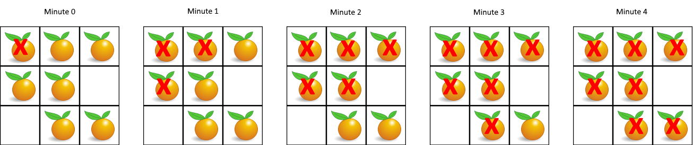

```swift
You are given an m x n grid where each cell can have one of three values:
```
```swift
0 representing an empty cell,
1 representing a fresh orange, or
2 representing a rotten orange.
```


https://leetcode.com/problems/rotting-oranges/description/


**Every minute, any fresh orange that is 4-directionally adjacent to a rotten orange becomes rotten.**


**Return the minimum number of minutes that must elapse until no cell has a fresh orange. If this is impossible, return -1.**

**Example 1:**




```swift
Input: grid = [[2,1,1],[1,1,0],[0,1,1]]
Output: 4
Example 2:
```

```swift
Input: grid = [[2,1,1],[0,1,1],[1,0,1]]
Output: -1
Explanation: The orange in the bottom left corner (row 2, column 0) is never rotten, because rotting only happens 4-directionally.
Example 3:
```

```swift
Input: grid = [[0,2]]
Output: 0
Explanation: Since there are already no fresh oranges at minute 0, the answer is just 0.
```
**Constraints:**
```swift
m == grid.length
n == grid[i].length
1 <= m, n <= 10
grid[i][j] is 0, 1, or 2.
```
**Solution**

```swift
class Solution {
    func orangesRotting(_ grid: [[Int]]) -> Int {
        //
        var grid = grid
        let rows = grid.count
        let cols = grid[0].count
        var queue: [(Int, Int)] = []
        var fresh: Int = 0
        //
        for i in 0..<rows {
            for j in 0..<cols {
                if grid[i][j] == 2 {
                    queue.append((i, j))
                } else if grid[i][j] == 1 {
                    //
                    fresh += 1
                }
            }
        }
        //
        var minutes: Int = 0
        var dirs: [(Int, Int)] = [(1, 0), (-1, 0), (0, 1), (0, -1)]
        if fresh == 0 {return 0}
        while(!queue.isEmpty && fresh > 0) {
            let size: Int = queue.count
            for _ in 0..<size {
                var (r, c) = queue.removeFirst()
                for (dr, dc) in dirs {
                    let nr: Int = r + dr
                    let nc: Int = c + dc
                    if nr >= 0 && nr < rows && nc >= 0 && nc < cols && grid[nr][nc] == 1 {
                        fresh -= 1
                        grid[nr][nc] = 2
                        queue.append((nr, nc))
                    }
                }
            }
            //
            minutes += 1
        }
        return fresh == 0 ? minutes : -1
    }
}
```

```swift
T.C.: O(m * n)
S.C>: O(m * n) in worst case Queue can take up all space
```
